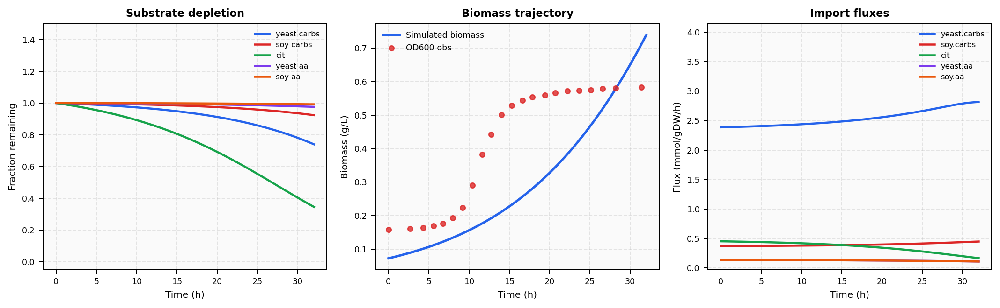
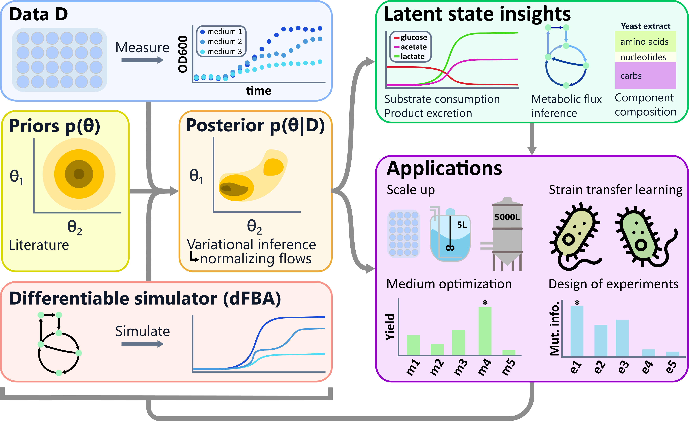

# Cutting Bioreactor Scale-Up Costs with a Differentiable Metabolic Simulator

*The physics of microbial growth doesn't change between a 96-well plate and a 1,000 L fermentor. Here's how we exploit that.*

*Tomek Diederen · March 2026*

---

**TL;DR**

- Developing growth media for fermentation still looks the same as it did forty years ago: mix nutrients, run experiments, adjust by hand. We built a simulator that predicts instead.
- We believe this is the first fully differentiable dynamic metabolic simulator — machine learning can now learn directly from mechanistic biological models, not around them.
- The entire inference runs on OD600 alone — no substrate assays, no metabolomics — and transfers what it learns directly to bioreactor scale.

---

## The Problem: Fermentation Optimisation Still Runs on Intuition

Probiotics are a multi-billion dollar industry. The organisms that make them — lactic acid bacteria like *Lactobacillus rhamnosus* and *L. casei* — are well-characterised and commercially important. Yet developing a growth medium for a new strain looks essentially the same as it did forty years ago: a bench scientist mixes nutrients, runs fermentations, and adjusts by hand. A typical recipe has ten or more components; each batch takes 32 hours; the design space expands combinatorially as ingredients are added. There is no systematic way to explore it.

High-throughput 96-well plate screening helps, but translating observed growth curves into actionable formulation decisions is still hard. The only readout available in a plate screen is OD600 — an optical proxy for biomass — yet medium performance depends on substrate consumption rates, secreted metabolite profiles, and internal fluxes that are never directly measured. The underlying biology is straightforward to state: cells consume substrates from the medium, convert them through a network of metabolic reactions into new biomass, and excrete products like lactate and acetate as byproducts. A useful model needs to track all three. Getting there from a growth curve alone is the challenge.

We address this through Bayesian inference over a dynamic flux balance analysis (dFBA) model of *Lactobacillus* growth, fitting exclusively to OD600. The framework infers which substrates the organism is consuming, what it is excreting, and how its metabolic network is allocating resources — all from the growth curve alone, without expensive analytical assays. This design enables four capabilities that existing approaches do not readily provide:

- **Cost-effective medium design**: once a posterior over kinetic parameters is available, formulations can be optimised against any user-specified objective — yield, cost, product titre, or any combination.
- **Decoding complex ingredients**: the macronutrient weight fractions of hydrolysates like yeast extract are treated as inferred parameters, decoded from growth data rather than assumed from supplier specifications.
- **Cross-strain transfer**: ingredient and shared-biochemistry parameters tighten from the joint dataset, reducing calibration burden for each new organism.
- **Scale-up prediction**: kinetic parameters describe the organism, not the vessel; posteriors inferred from plate data carry directly to bioreactor predictions without re-fitting.

---

## Why Mechanistic Models — and Why They Break

The natural computational framework for this problem is **dynamic flux balance analysis** (dFBA), widely adopted by experimental practitioners for modelling batch fermentations. It represents the organism's metabolic network as a set of biochemical reactions, assumes cells maximise their growth rate subject to enzyme capacity constraints, and tracks how substrate concentrations evolve over time. Think of it as a digital twin for the organism — similar in spirit to how aerospace engineers simulate airflow before building a wind tunnel, or how chip designers simulate circuits before committing to silicon.

dFBA has a structural problem that becomes critical the moment you want to use it for machine learning. At every time step, the model solves an optimisation problem to determine which reactions are running at what rate. The deeper issue is **differentiability**: fitting the model to data requires gradients — the mathematical answer to "if I change this parameter slightly, how does the prediction change?" As the organism shifts metabolic strategy — switching from glucose to amino acids as its primary carbon source, say — the solver's output changes discontinuously. Gradient-based inference becomes impossible.

Without gradients, machine learning cannot learn from the simulator. You can run it, but you cannot fit it.

This problem is not unique to biology. In particle physics, differentiable detector simulators are replacing Monte Carlo methods at CERN. [AlphaFold](https://www.nature.com/articles/s41586-021-03819-2) relied critically on differentiating through a structural scoring function to learn protein geometry from sequence. [NeuralGCM](https://www.nature.com/articles/s41586-024-07744-y) embeds differentiable atmospheric physics into a climate model, closing the gap between data-driven forecasting and physics-based prediction. The common thread: wherever you make the simulator differentiable, machine learning learns from it rather than around it. Biology is the harder version — noisier, operating across more timescales, with components whose composition you do not fully know. But the payoff is proportionally larger.

---

## The Core Innovation: Making the Simulator Differentiable

Our approach is the **Relaxed Interior-Point ODE** (R-iODE), building on foundational work by [Scott (2018)](https://www.sciencedirect.com/science/article/abs/pii/S0098135418309190) that we extend substantially. Instead of calling an optimisation solver at every time step and getting a non-differentiable answer, we embed the conditions that define an optimal solution — the KKT conditions — directly into the differential equation describing the system's dynamics. The solver runs once, at the start of the simulation. From there, a smooth system tracks the optimal metabolic state continuously as concentrations evolve. No discrete jumps. No undefined gradients. Just a smooth ODE — gradients flow through the full trajectory.

One practical challenge: the resulting ODE is high-dimensional, with roughly 50 reaction fluxes. A key contribution is **null-space reduction**: a coordinate transformation that exploits conservation laws in metabolic networks to compress the problem from ~50 variables to ~15 without losing information. Per-experiment simulation time drops from ~2 seconds to ~0.03 seconds after JIT compilation — a 60× speedup that makes running 2,100 simulations in a training loop feasible.

We also introduce three smooth **gating functions** that handle biological realities absent from the engineering settings where R-iODE was originally developed: a tapering function for graceful substrate exhaustion, an energy maintenance gate for ATP feasibility late in a batch, and a biomass objective gate that prevents numerical blow-up as growth winds down.

Here is what a successful simulation looks like:

*A representative 32-hour batch fermentation. Substrate concentrations decline as the organism grows; import fluxes track kinetics and resource allocation in real time. Computed by integrating a single smooth ODE — no optimisation solver in the loop.*

---

## What Differentiability Unlocks: Bayesian Inference at Scale

With a differentiable simulator, Bayesian inference over ~60 biological parameters becomes possible — fitted simultaneously to ~2,100 fermentation experiments across 54 distinct medium compositions. These parameters θ are biochemical quantities: kinetic rate constants, enzyme capacity bounds, stoichiometric coefficients for complex hydrolysate fractions, and maintenance energy requirements. Critically, the only input signal is OD600; substrate concentrations, product secretion, and internal fluxes are inferred as latent variables constrained by metabolic network stoichiometry. No substrate assays. No metabolomics. Just growth curves.

The difference between a point estimate and a full posterior matters practically. A posterior tells you **how confident you should be** — shaping which medium to test next, and whether a scale-up prediction is reliable enough to act on. It also enables principled experiment design: **mutual information** (Mut. Info.) between candidate experiments and model parameters quantifies how much a proposed run would reduce parameter uncertainty. Selecting the experiment that maximises mutual information is provably the most efficient way to learn — directing expensive fermentation runs toward conditions that answer open questions rather than repeating what the model already knows. Our robotic 96-well plate platform generates OD600 growth curves at high throughput, and the differentiable simulator is what makes it possible to extract mechanistic insight from all of them simultaneously.

*The inference pipeline. **Data D** (top left): OD600 growth curves from 96-well plate screens across many medium compositions — the only signal we fit to. **Prior p(θ)** and **Posterior p(θ|D)** (middle left): we begin with literature-informed prior distributions over biochemical parameters θ and update them via variational inference with normalising flows. **Differentiable simulator** (bottom left): at the heart of inference, the dFBA simulator takes θ and a medium as input and produces ODE trajectories; differentiability is what makes gradient-based posterior fitting possible. **Latent state insights** (top right): because the simulator tracks the full metabolic state, substrate consumption, product excretion, import fluxes, and hydrolysate composition are recovered as latent variables even though they were never measured. **Applications** (bottom right): the calibrated posterior supports scale-up prediction, strain transfer, medium optimisation, and mutual-information-guided experiment design.*

---

## Decoding Complex Ingredients: Alpha Fractions

Industrial fermentation media are not collections of pure metabolites. Yeast extract, peptones, and meat extract are complex hydrolysates whose composition varies by supplier and batch. The metabolic model needs macronutrient concentrations in millimolar; the recipe gives you grams per litre of an ill-defined mixture.

We introduce **alpha fractions** — learnable parameters encoding the weight fractions of carbohydrates and protein in each complex ingredient, inferred jointly with the kinetic parameters from growth data. The information is not on the label; it is encoded in the growth response. Because alpha fractions are properties of the ingredient rather than the organism, they are shared across strains and inferred jointly from the full dataset — a new strain does not require fresh characterisation of yeast extract, only its own kinetic parameters.

---

## Three Ways to Model Fermentation

Our only observable is OD600. The question is whether the model structure allows unobserved variables — substrate consumption, product secretion — to be inferred from it.

**Regression on summary statistics** fits a curve to each growth trajectory and regresses the resulting statistics against the medium. It is fast but says nothing about substrates or products, cannot distinguish nitrogen-limited from energy-limited media, and extrapolates poorly outside the training distribution.

**Neural ODEs** learn the growth differential equation directly from data, capturing biphasic or asymmetric trajectories that no fixed curve can represent. A genuine advantage over regression — but the state is still just biomass. There is no structure that connects internal metabolic state to the observable signal, so substrate and product dynamics simply cannot be inferred.

**The grey-box simulator** models the same dynamics but its internal state includes the full picture: substrates consumed, biomass accumulated, products excreted. The metabolic network constrains how these variables relate to each other, so substrate and product trajectories can be inferred from OD600 alone. Designing a cheaper medium requires knowing which substrates the organism is actually consuming; predicting bioreactor behaviour requires tracking what happens to nutrients over time. Neither question can be answered by a model that represents only what it directly observes.

We are not claiming hybrid modelling is the only approach — it is the one we are committed to, alongside our existing neural network ensemble platform.

---

## Scale-Agnostic by Design

Kinetic parameters describe the organism, not the vessel. When you move from a 200 µL well to a 1,000 L bioreactor, mass transfer and hydrodynamics change. The biochemistry does not.

This is the scale transfer argument: learn the biology at small scale, apply it everywhere. Posteriors inferred from plate data carry directly to bioreactor-scale predictions. As data from larger scales becomes available, the posterior updates — each new scale adds accuracy rather than requiring a model rebuild from scratch. The path from 96-well plate to production scale is shorter when the model encodes the organism's biochemistry rather than the geometry of the vessel it was grown in.

---

## Simulator State: What Works and What Doesn't

Successful simulations look biologically sensible: glucose consumed preferentially, secondary substrates following as primary carbon depletes, biomass accumulating in a sigmoid curve. Not every simulation finishes. Systematic sweeps show 83% completion varying parameter seeds and 97% varying medium composition. The dominant failure mode is ODE step-size collapse as substrates exhaust and the feasible polytope shrinks. The three gating functions address the known causes; raising completion rate further across the full prior distribution remains the primary numerical engineering challenge.

One honest note: fixing the interior-point barrier at a small positive value means the simulator tracks the central path of the metabolic optimisation rather than its exact solution, introducing a slight bias relative to classical dFBA. In practice this is negligible — the barrier is fixed at ~10⁻⁵, and dFBA is itself a coarse approximation of real cellular metabolism.

---

## What Comes Next

The simulator is running. The remaining challenge is inference at full scale: fitting a [normalising flow](https://arxiv.org/abs/1906.04032) as an approximate posterior over ~60 parameters across ~2,100 experiments spanning 54 medium compositions. Two prerequisites remain: completing gradient validation through the full adjoint pass, and raising simulation completion rate across the prior.

When both are resolved, the approach is not limited to *Lactobacillus* or probiotic production. Any organism with a sufficiently curated genome-scale metabolic model and accessible batch OD600 data is a candidate for this inference pipeline. Extensions to fed-batch or continuous culture require modifications to the extracellular dynamics but not to the core simulator. And the posterior distributions over latent substrate trajectories point directly to which targeted metabolomics measurements would most reduce parameter uncertainty — connecting model-based inference to efficient experimental design.

The immediate next steps are completing gradient validation, running the normalising flow training, and validating inferred substrate dynamics against targeted metabolomics measurements. We are looking for collaborators — computational biologists, systems biologists, and fermentation scientists — and we are hiring.

---

## Closing

Forty years of mixing nutrients and adjusting by hand. The bench scientist who runs that experiment is doing something irreplaceable — biology is too complex, and experimental intuition too valuable, to automate away. But the step from a hundred experiments to ten thousand should not rely on intuition alone. That is what the simulator is for: not to replace the scientist, but to make every experiment they run carry more information, reach further, and cost less.

---

*Differential Bio is building AI-native tools for microbial fermentation optimisation. If you are interested in collaborating or joining the team, reach out at [diederent@gmail.com](mailto:diederent@gmail.com).*

*⚠️ Pre-publication note: strain names, experiment counts, and the novelty claim regarding differentiable dFBA are flagged for verification before public release.*
