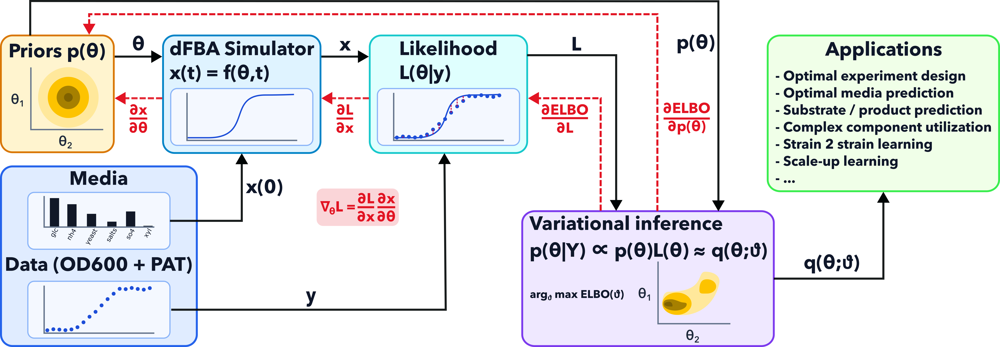

# Cutting Bioreactor Scale-Up Costs with a Differentiable Metabolic Simulator

*The physics of microbial growth doesn't change between a 96-well plate and a 1,000 L fermentor. Here's how we exploit that.*

*Tomek Diederen · March 2026*

---

**TL;DR**

- Developing growth media for fermentation still looks the same as it did forty years ago: mix nutrients, run experiments, adjust by hand. We want to predict instead.
- We built what we believe is the first fully differentiable dynamic metabolic simulator — meaning machine learning can now learn directly from mechanistic biological models, not around them.
- Trained on cheap 96-well plate data across ~3,000 fermentation experiments, the simulator decodes how organisms use complex ingredients and transfers that knowledge directly to bioreactor scale.

---

## The Problem: Fermentation Optimisation Still Runs on Intuition

Probiotics are a multi-billion dollar industry. The organisms that make them — lactic acid bacteria like *Lactobacillus rhamnosus*, *L. casei*, and *L. salivarius* — are well-characterised, commercially important, and the subject of decades of research. Yet the process of developing a growth medium for a new strain looks essentially the same as it did forty years ago: a bench scientist mixes nutrients, runs fermentations, and adjusts by hand. The search space is enormous. A typical recipe has ten or more components. Each batch takes 32 hours. There is no systematic way to explore.

We want to do something different: **predict** how a strain will grow across thousands of medium compositions, and use those predictions to:

- **Design cost-effective media** — identify the cheapest formulation that still hits a target biomass yield
- **Decode complex ingredients** — learn the weight fractions of macronutrients such as carbohydrates and protein in complex hydrolysates like yeast extract and peptones, turning an opaque ingredient into a characterised set of nutrient inputs
- **Reduce experimental burden for new strains** — some parameters are unique to a strain (glucose uptake rate, substrate preferences), but others are shared across strains (the composition of yeast extract, energy maintenance requirements, the structure of the metabolic network). Parameters that are shared do not need to be re-learned from scratch for each new organism; only the strain-specific ones require fresh experiments
- **Transfer knowledge to bioreactors** — the kinetic parameters inferred from plate data describe the organism, not the vessel; the same model informs scale-up predictions

The underlying biology is straightforward to state. Cells consume **substrates** from the medium — glucose, amino acids, vitamins, minerals — convert them through a network of metabolic reactions into new biomass, and excrete **products** like lactate and acetate as byproducts. The rate at which this happens, and which substrates get consumed in which order, determines the shape of the growth curve and the composition of the broth at harvest. A useful model needs to track all three: substrates going in, biomass accumulating, products coming out.

This is not a new ambition. What is new is our ability to act on it — because we have built a simulator that can learn.

There is an immediate challenge worth naming: industrial fermentation media are not collections of pure metabolites. A typical recipe includes components like yeast extract, peptones, and meat extract — complex hydrolysates whose exact molecular composition is only partially characterised. The metabolic model needs concentrations of individual molecules in millimolar; the recipe gives you grams per litre of a mixture. We will come back to how we handle this.

---

## Why Mechanistic Models — and Why They Break

The natural computational framework for this problem is **dynamic flux balance analysis** (dFBA). It is a well-established approach in systems biology: represent the organism's metabolic network as a set of biochemical reactions, assume cells maximise their growth rate subject to enzyme capacity constraints, and track how substrate concentrations evolve over time. Think of it as a detailed digital twin — similar in spirit to how aerospace engineers simulate airflow before building a wind tunnel, or how chip designers simulate circuits before committing to silicon. Other industries model before they build. Biology has been slow to follow, partly because the models are harder.

dFBA has a structural problem that becomes critical the moment you want to use it for machine learning. At every moment in time, the model solves an optimisation problem to figure out which metabolic reactions are running at what rate. This is computationally expensive but tractable. The deeper issue is **differentiability**: when you want to fit the model to experimental data, you need gradients — the mathematical equivalent of asking "if I change this parameter slightly, how does the prediction change?" The optimisation solver at the core of dFBA cannot answer that question cleanly. As the organism shifts from one metabolic strategy to another — for instance, switching from glucose to amino acids as its primary carbon source — the solver's output changes discontinuously. JAX, the numerical computing library we use, returns NaN. Gradient-based inference becomes impossible.

Without gradients, machine learning cannot learn from the simulator. You can run it, but you cannot fit it. You get a tool for forward simulation, not for inference.

This problem is not unique to biology — and the solutions developed in other fields point the way forward. In [particle physics](https://arxiv.org/abs/2203.05570), differentiable detector simulators are replacing expensive Monte Carlo methods at CERN, enabling end-to-end optimisation of experimental design. In [cosmology](https://arxiv.org/abs/2202.07440), differentiable N-body simulations allow field-level inference that extracts far more information from galaxy surveys than traditional summary statistics ever could. [AlphaFold](https://www.nature.com/articles/s41586-021-03819-2) — arguably the most celebrated scientific AI result of the last decade — relied critically on differentiating through a structural scoring function to learn protein geometry from sequence. [NeuralGCM](https://www.nature.com/articles/s41586-024-07744-y) from Google DeepMind embeds differentiable atmospheric physics into a learned climate model, closing the gap between data-driven weather forecasting and physics-based prediction. The common thread: wherever you can make the simulator differentiable, machine learning can learn from it rather than around it. NVIDIA has made major recent investments in back-differentiable physics engines for exactly this reason. Biology is the harder version — less linear, noisier, operating across more timescales, with components whose composition you do not fully know. But the payoff is proportionally larger.

---

## The Core Innovation: Making the Simulator Differentiable

Back-differentiability is not a minor technical improvement. It is what allows gradient descent — the engine of all modern machine learning — to be applied directly to biological modelling. It is the thing that turns a simulation tool into a learning tool.

Our approach is called the **Relaxed Interior-Point ODE** (R-iODE), following foundational work by [Scott (2018)](https://www.sciencedirect.com/science/article/abs/pii/S0098135418309190) that we have substantially extended. The idea is elegant. Instead of calling an optimisation solver at every time step and getting a non-differentiable answer, we embed the conditions that define an optimal solution — the KKT conditions, for those familiar with constrained optimisation — directly into the differential equation that describes the system's dynamics. The solver runs once, at the start of the simulation. From there, a smooth mathematical system tracks the optimal metabolic state continuously as substrate concentrations evolve. No discrete jumps. No undefined gradients.

The result: no LP, no QP at each step. Just a smooth ODE. Gradients flow through the full trajectory.

One practical challenge is that the resulting differential equation is high-dimensional — the full metabolic network has roughly 50 reaction fluxes. A key engineering contribution is what we call **null-space reduction**: a coordinate transformation that exploits the conservation laws built into metabolic networks to compress the problem from ~50 variables to ~15, without losing any information. This makes the approach computationally tractable at scale — per-experiment simulation time drops from ~2 seconds to ~0.03 seconds after JIT compilation, a 60× speedup. Running 3,000 simulations in a training loop becomes feasible.

We also introduce three smooth **gating functions** that handle biological realities not present in the chemical engineering settings where R-iODE was originally developed: a tapering function that ensures substrate uptake rates approach zero gracefully as nutrients are exhausted, an energy maintenance gate that keeps the system feasible when ATP availability becomes tight at the end of a batch, and a biomass objective gate that prevents numerical blow-up as growth winds down.

---

## What Differentiability Unlocks: Bayesian Inference at Scale

With a differentiable simulator, Bayesian inference over ~60 biological parameters becomes possible — fitted simultaneously to ~3,000 fermentation experiments.

The difference between a point estimate and a full posterior distribution matters practically. A point estimate tells you the most likely parameter values. A posterior tells you **how confident you should be**. That shapes which medium to test next, which experiment would be most informative for a new strain, and whether a scale-up prediction is reliable enough to act on. It is the difference between a single prediction and a distribution over predictions with honest uncertainty bounds.

The data source is deliberately cheap: OD600 growth curves, which our robotic 96-well plate platform generates at high throughput. No expensive metabolomics required. We measure optical density every two hours over 32-hour batch fermentations for three *Lactobacillus* strains across thousands of distinct medium compositions. That is a lot of growth curves. The differentiable simulator is what makes it possible to extract mechanistic insight from all of them simultaneously.

This is not a separate research project. The same data pipeline feeds directly into the high-throughput screening workflow we use for customers today.

*Figure: Pipeline used in the blog post. Medium composition (`c0`) initializes the simulator, observations enter the simulator likelihood term, variational inference updates `q_ϑ(θ)` with priors `p(θ)`, and inferred biochemical parameters `θ` feed downstream applications (media design, scale transfer, and planning). Source vector graphic: `inference_pipeline.svg`.*

---

## Decoding Complex Ingredients: Alpha Fractions

Yeast extract is a black box: carbohydrates, proteins, nucleotides, and vitamins in proportions that vary by supplier and batch. The metabolic model needs macronutrient concentrations in millimolar; the recipe gives you a mass per litre of an ill-defined mixture. We introduce **alpha fractions** — learnable parameters encoding the weight fractions of macronutrients like carbohydrates and protein in each complex ingredient, inferred jointly with the kinetic parameters from growth data. The information is not on the label; it is encoded in the growth response, and the posterior extracts it.

Alpha fractions are properties of the ingredient, not the organism, so they are shared across strains and inferred jointly from all three *Lactobacillus* datasets — meaning a new strain does not require a fresh characterisation of yeast extract composition, only its own kinetic parameters.

---

## Three Ways to Model Fermentation — and Why the Choice Matters

Our observations are partial: the plate reader gives us OD600, a proxy for biomass. We have no time-resolved measurements of substrate concentrations or product accumulation. This is a fundamental constraint — but it does not mean we are limited to modelling only biomass. The question is whether the model structure allows unobserved variables to be inferred from the signal we do have.

**Regression on summary statistics.** The simplest approach assumes a fixed functional form — typically a Gompertz curve — and fits it to each growth trajectory to extract summary statistics: maximum OD, growth rate, time to stationary phase. These are then regressed against the input medium. The Gompertz assumption is a strong one: real growth curves can be biphasic, asymmetric, or show extended lag phases that no single sigmoid captures well. More fundamentally, even a perfect fit says nothing about substrates or products. The model has no concept of nutrient depletion, cannot distinguish a nitrogen-limited medium from an energy-limited one, and cannot extrapolate reliably outside the training distribution. It is a description of the growth curve shape, not a model of the biology behind it.

**Neural ODEs.** A neural ODE drops the Gompertz assumption entirely, learning the differential equation governing biomass dynamics directly from data. This gives it the flexibility to capture complex trajectories — biphasic growth, unusual lag phases, asymmetric stationary phases — without any prescribed functional form. That is a genuine advantage over regression. But the state it models is still just biomass. Substrates and products remain absent, not because of a limitation that could be engineered away, but because there is no structure in the model that would connect them to the observable signal. A neural ODE fit to OD600 data has learned a flexible curve; it has not learned any biology.

**The grey-box simulator.** Our simulator models the same complex growth dynamics, but its internal state includes the full picture: substrates being consumed, biomass accumulating, products being excreted. Critically, the metabolic network constrains how these variables relate to each other — substrate depletion must be consistent with the observed biomass gain, product excretion must balance the carbon budget. This means substrate and product dynamics can be inferred from the OD600 signal alone, even though we never measure them directly. The model treats them as latent variables tied to the observable through known biochemistry, not as quantities that must be observed to be modelled.

This is what makes the grey-box approach useful for our goals. Designing a cheaper medium requires knowing which substrates the organism is actually consuming. Predicting bioreactor behaviour requires tracking what happens to nutrients and products over time, not just the biomass trajectory. None of those questions can be answered by a model that only represents what it directly observes.

We should be honest about the limits. The simulator has ~60 parameters, and interpretability should not be overstated. The practical argument — fewer experiments, cheaper media, faster scale-up — is stronger than the philosophical one. We are not claiming hybrid modelling is the only approach; it is the one we are committed to developing, alongside our existing neural network ensemble platform.

---

## Scale-Agnostic by Design

The kinetic parameters we infer from 96-well plate data describe the organism, not the vessel. When you move from a 200 µL well to a 1,000 L bioreactor, the process environment changes — mass transfer, hydrodynamics, temperature gradients. The biochemistry does not.

This is the **scale transfer argument**: learn the biology at small scale, apply it everywhere. Because the posterior over kinetic parameters is a property of the organism, it carries directly to bioreactor-scale predictions. As new data from larger scales becomes available, the posterior updates. Each new scale adds accuracy rather than requiring a model rebuild from scratch.

The path from 96-well plate to production scale is shorter when the model you are scaling encodes the organism's biochemistry rather than the geometry of the vessel it was grown in.

---

## What Is Still Hard — and What Comes Next

The simulator itself — the R-iODE, null-space reduction, gating functions, and probabilistic model — is complete and running on all three strains. The remaining challenge is inference at full scale: fitting a [normalising flow](https://arxiv.org/abs/1906.04032) as an approximate posterior over ~60 parameters simultaneously across ~3,000 experiments using variational inference. Normalising flows are a class of deep generative model that learn a flexible probability distribution by composing invertible transformations — well-suited to the skewed, bounded posteriors that arise over kinetic parameters. Getting gradient stability through 3,000 parallel ODE integrations in a single training loop is the active engineering problem.

The immediate next step is completing that inference pipeline, validating the inferred substrate dynamics against targeted metabolomics measurements, and submitting the preprint.

We are looking for collaborators — computational biologists, systems biologists, and fermentation scientists who want to work on these problems — and we are hiring.

---

## Closing

Forty years of mixing nutrients and adjusting by hand. The bench scientist who runs that experiment is doing something irreplaceable — biology is too complex, and experimental intuition too valuable, to automate away. But the step from a hundred experiments to a thousand to ten thousand to a hundred thousand should not rely on intuition alone. That is what the simulator is for: not to replace the scientist, but to make every experiment they run carry more information, reach further, and cost less.

---

*Differential Bio is building AI-native tools for microbial fermentation optimisation. If you are interested in collaborating or joining the team, reach out at [diederent@gmail.com](mailto:diederent@gmail.com).*

*⚠️ Pre-publication note: strain names, experiment counts, and the novelty claim regarding differentiable dFBA are flagged for verification before public release.*
